# Assignment Part A: Coverage Analysis for RingBuffer

For this assignment, we used *JaCoCo*[^1] as the Code Coverage library. In our first assignment, we used *Maven*[^2] as our dependency management tool. We kept Maven and used the same project structure for the current assignment. Therefore, we used the *jacoco-maven-plugin* in our `pom.xml` file.

The following command starts the JUnit and Coverage Check:
    
    mvn clean test

Obviously, you can also start the test via the IDE:

    Run as -> Maven test

After running the tests, JaCoCo deploys the Coverage information into the following directory:

    ./exercise01/target/site/jacoco-ut

## Use a coverage tool to measure the coverage.

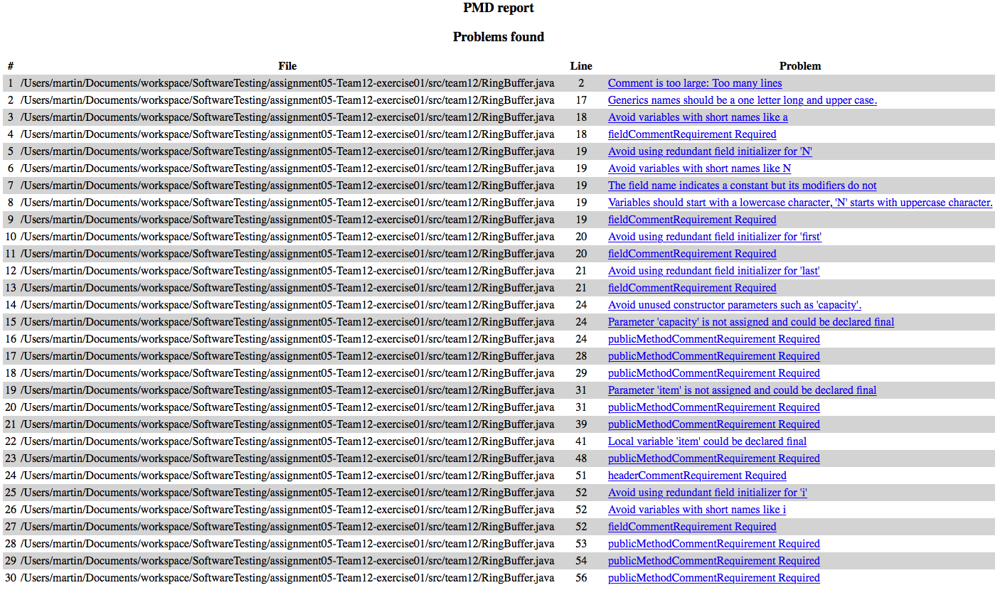
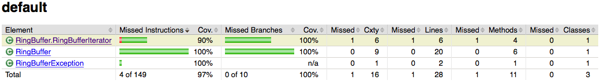
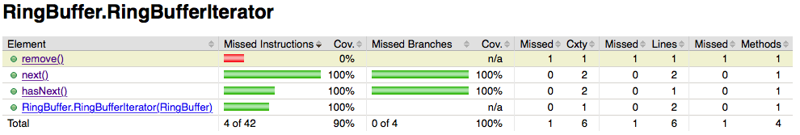

As you can see from the figures, we reached a Coverage of 97%. The only method we did not test, was the *remove()* method of the RingBufferIterator. You can find the report in our submission under `./exercise01/doc/coverage_before`.

## Add additional unit tests to *RingBufferTest* to fully cover the RingBuffer implementation.

To accomplish the 100% Coverage, we added another unit test:

```java

/**
* Test if the UnsupportedOperationException gets fired on calling the remove() method.
*/
@Test(expected = UnsupportedOperationException.class)
public void testRingBufferIteratorRemove() {
   emptyBuffer.iterator().remove();
}

```

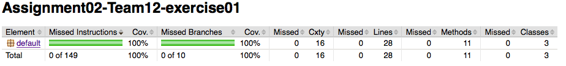

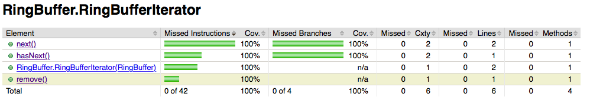

After adding this new unit test, the coverage result shows now a coverage of 100%. You can find the report in our submission under `./exercise01/doc/coverage_after`.

# Assignment Part B: Mutation Analysis for RingBuffer

# Assignment Part C: Coverage analysis of the tests for the code of your own choice

For the third exercise we used the same Code Coverage library as in exercise 1 (JaCoCo[^1]) with the same settings, so the coverage test can be started like the one in exercise 1.

## Coverage of the overall software system

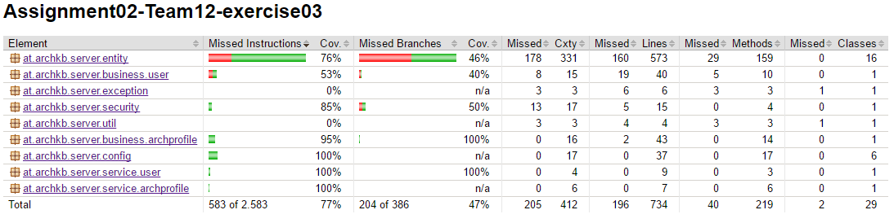

## Coverage of the classes you selected for testing

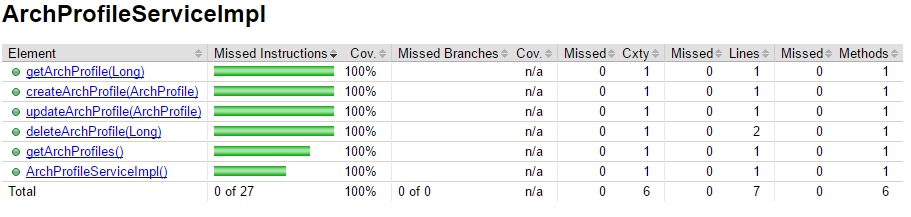

## Coverage of other classes not selected for testing

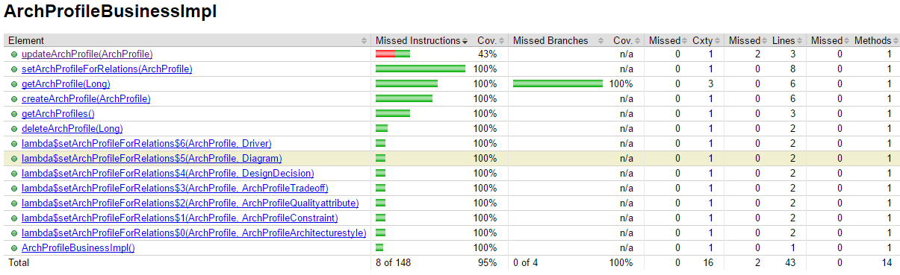
Since the ArchProfileServiceImpl class selected for testing is tightly coupled with the ArchProfileBusinessImpl class, the methodes of this class are also coverd in the test

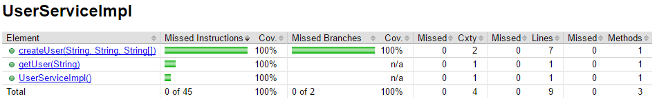
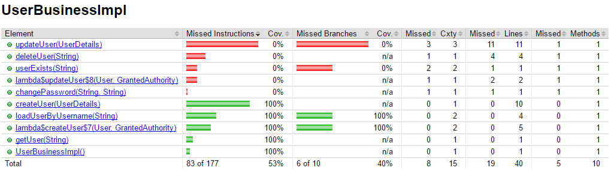
The classes UserServiceImpl and UserBusinessImpl are covered by the unittest for setting up an initial state in the database for the tests and for the evaluation of the method-level-security defined in the class selected for testing

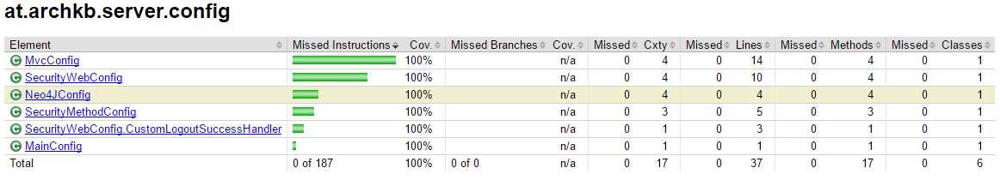
The config classes are used by the Springframework to set up the testenvironment

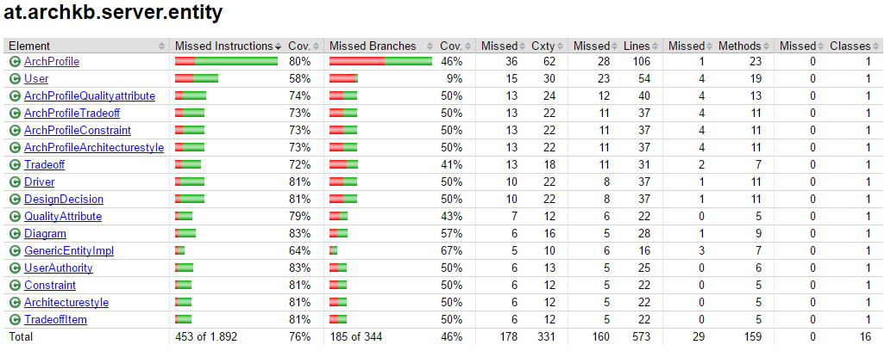

As the class selected for testing mainly tests the behaviour of the database, the entities which are stored in the database are partially also covered by the tests

[^1]:
see <http://eclemma.org/jacoco> for further information.
[^2]:
see <https://maven.apache.org> for further information.