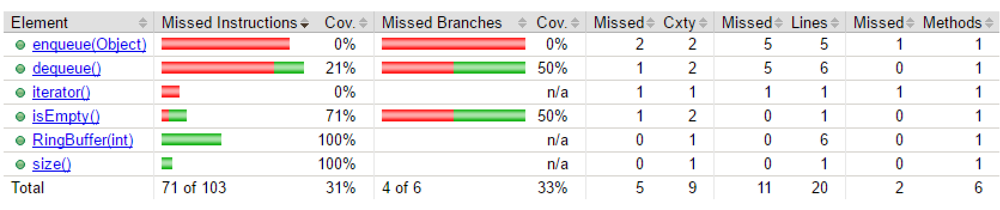
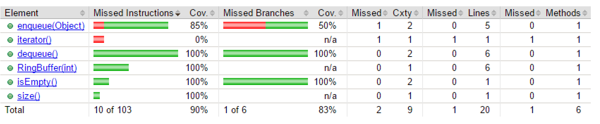

# Assignment Part A: Random Test Case Generation for RingBuffer

For this part of the assignment, we used *Randoop* as the test case generator. We created test cases for different time spans (10s, 30s, 60s, 120s, 240s, 300s and 360s). The generated test cases are part of the submission. The randoop output files can be found under the `randoop` folder.

For the coverage analysis, we used *JaCoCo*[^1] again.

## Question 1: Increase the time limit for test generation step by step to, for example, 20 seconds, 30 sec., 60 sec., 120 sec., etc. Measure the code coverage of the generated test cases for each generated set of tests. At what point do you reach the maximum coverage (plateau) where more generation time does not lead to an increase of coverage? What is the maximum coverage?

The following table shows the results for the coverage[^2] -, as well as the mutation analysis:

| Time [s] | Code Coverage [%] | Mutation Score  | Total Instructions |
|---------:|------------------:|-----------------:|------------------:|
| 10       | 85.9              |                  | 159.859           |
| 30       | 87.9              |                  | 434.482           |
| 60       | 88.9              |                  | 783.883           |
| 120      | 89.6              |                  | 1.259.428         |
| 240      | 90.4              |                  | 2.334.648         |
| 300      | 90.6              |                  | 2.703.000         |
| 360      | 90.9              |                  | 3.363.333         |
| 500      | 91.1              |                  | 4.358.351         |
| 700      | 91.4              |                  | 5.496.704         |
| 900      | 91.6              |                  | 6.958.180         |
| 1200      |             |                  |          |
| 1800      |               |                  |          |

todo

## Question 2: Does the achieved coverage and mutation score imply that the tested class is correct? Discuss this question in your group and explain why or why not.

to be discussed

# Assignment Part B: Model-based Testing for RingBuffer

To Include the ModelJUnit libaray we are using a maven dependency.

## Simple Model

In the first step we created a test model for the RingBuffer. In this model we override the getState methode. This methode returns a String represention of the states Full, Empty and Filled of the RingBuffer.
We also override the reset method which resets the RingBuffer with a random maximum size between 1 and 10. Afterwards we defined the actions for enque and deque of the Ringbuffer. In this Simple Model we also
defined Guards for those methodes to ensure that enque is only called when the RingBuffer is not full and that dequeue is only called when the RingBuffer is not empty.
The results of the model execution can be found in the output folder.

## Model with Adapter

In a second step we adapted the Simple Model. We introduced a counter variable to check if the amount of objects in the Ringbuffer is correct. We deleted the guards to also get not allowed transitions which throws exceptions to also test this behaviour.
For the dequeue and enqueue methods we provided assertions to check for right behaviour of the ringbuffer. The results of the model execution can be found in the output folder.

### Failure detection
To also check if the model would find failures in the ringbuffer we introduced bugs. We tested model the following bugs: commenting out incrementation of N, commenting out decrementation of N, commenting out setting of first, commenting out setting of last.
All this bugs were successfully recognised by the model.

### Code coverage
For the coverage analysis, we used *JaCoCo*[^1] again.

First we tested the model with zero testcases and it can be seen that neither dequeue nor enqueue was executed.

Afterwards we tested the model with one testcases which executes the dequeue methode and it can be seen that the dequeue method is not fully covered sinc only the exception case was executed

Afterwards we tested the model with 5 testcases and it can be seen that the dequeue is fully covered while enque is only partially covered since the enqueue methode with a full ringbuffer (=exception case) is never executed

Afterwards we tested the model with 20 testcases and it can be seen that the dequeue and enqueue is fully covered. So it does not make sense to make further coverage tests since more test cases can not increase the coverage.

[^1]:
see <http://eclemma.org/jacoco> for further information.
[^2]:
in percent of the respective package, not for the overall project