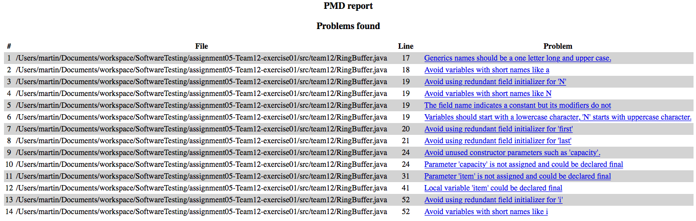

# Assignment Part A: Coverage Analysis for RingBuffer

For this assignment, we used *JaCoCo*[^1] as the Code Coverage library. In our first assignment, we used *Maven*[^2] as our dependency management tool. We kept Maven and used the same project structure for the current assignment. Therefore, we used the *jacoco-maven-plugin* in our `pom.xml` file.

The following command starts the JUnit and Coverage Check:
    
    mvn clean test

Obviously, you can also start the test via the IDE:

    Run as -> Maven test

After running the tests, JaCoCo deploys the Coverage information into the following directory:

    ./exercise01/target/site/jacoco-ut

## Use a coverage tool to measure the coverage.




As you can see from the figures, we reached a Coverage of 97%. The only method we did not test, was the *remove()* method of the RingBufferIterator. You can find the report in our submission under `./exercise01/doc/coverage_before`.

## Add additional unit tests to *RingBufferTest* to fully cover the RingBuffer implementation.

To accomplish the 100% Coverage, we added another unit test:

```java

/**
* Test if the UnsupportedOperationException gets fired on calling the remove() method.
*/
@Test(expected = UnsupportedOperationException.class)
public void testRingBufferIteratorRemove() {
   emptyBuffer.iterator().remove();
}

```


After adding this new unit test, the coverage result shows now a coverage of 100%. You can find the report in our submission under `./exercise01/doc/coverage_after`.

# Assignment Part B: Mutation Analysis for RingBuffer

In order to do mutation testing, we used [PIT](http://pitest.org/) as proposed in the assignment. For this assignment, the [intellij plugin](https://plugins.jetbrains.com/plugin/7119?pr=) was used. The plugin allows to run a project with PIT after specifying target classes, source and report dir and any other parameters. This can all be configured under `Run -> Edit Configurations...`, but in the end it comes down to a simple call to the command-line interface. The call that was used to get to the results of the mutation testing for this exercise - when assuming we are already located in the project directory (`./`) - comes down to

    java -cp <classpath> org.pitest.mutationtest.commandline.MutationCoverageReport --reportDir exercise02/target/report --sourceDirs exercise02/src --targetClasses tobemutated.* --outputFormats XML,HTML

In order for PIT to work as expected, we had to have a package again (in the previous exercise we got rid of it in order to get a nicer directory structure) in order to be able to be able to filter the classes that need to be mutated. Instead of the old package names, I prefered to move the code in the `tobemutated` package. We also had to remove our failing test, because PIT only expects a green suite.

## Find surviving mutants


PIT generates nicely formatted HTML coverage reports that give a nice overview of what mutants were generated and which of those survived for each class under test. From the snapshots of those reports, it turns out that with our current tests we can kill 95% of the mutants, but still one survived. The complete report can be found under `./exercise02/doc/mcoverage_before`.

## Get full coverage

From the reports above it is quite clear that we forgot to check whether the size actually decrements when taking an element away from the buffer with `dequeue()`. Because this is tested within `testEnqueue()`, an extra line in `testDequeue()` has been added rather than a completely new test. After filling the buffer in `testDequeue()`, half of the elements are removed, but the size is not checked. Adding the new line (indicated by the comment), additionally tests whether the size of the buffer is actually decremented when an element is dequeud. The end of `testDequeue()` then looks as follows

```java
    ...
    for(int i = 0; i < SIZE / 2; i++) {
        assertEquals(ELEMENT + i, emptyBuffer.dequeue());
        assertEquals(SIZE - i - 1, emptyBuffer.size());     // new line
    }
```


Running the modified test with PIT, we get a 100% coverage as can be seen in the snapshots of the report. The entire report after modifying the test can be found in `./exercise02/doc/mcoverage_after`.

# Assignment Part C: Coverage analysis of the tests for the code of your own choice

For the third exercise we used the same Code Coverage library as in exercise 1 (JaCoCo[^1]) with the same settings, so the coverage test can be started like the one in exercise 1.

## Coverage of the overall software system


## Coverage of the classes you selected for testing


## Coverage of other classes not selected for testing


Since the ArchProfileServiceImpl class selected for testing is tightly coupled with the ArchProfileBusinessImpl class, the methodes of this class are also coverd in the test


The classes UserServiceImpl and UserBusinessImpl are covered by the unittest for setting up an initial state in the database for the tests and for the evaluation of the method-level-security defined in the class selected for testing


The config classes are used by the Springframework to set up the testenvironment


As the class selected for testing mainly tests the behaviour of the database, the entities which are stored in the database are partially also covered by the tests

[^1]:
see <http://eclemma.org/jacoco> for further information.
[^2]:
see <https://maven.apache.org> for further information.
