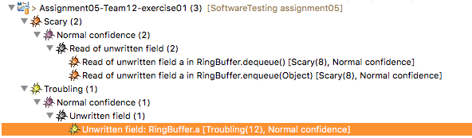
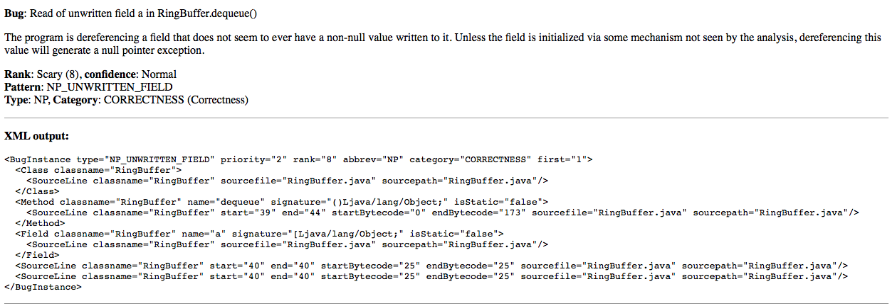
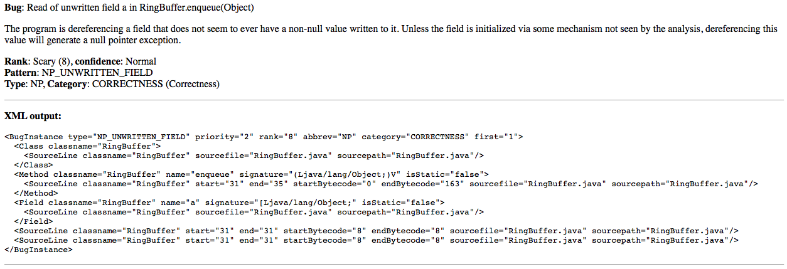
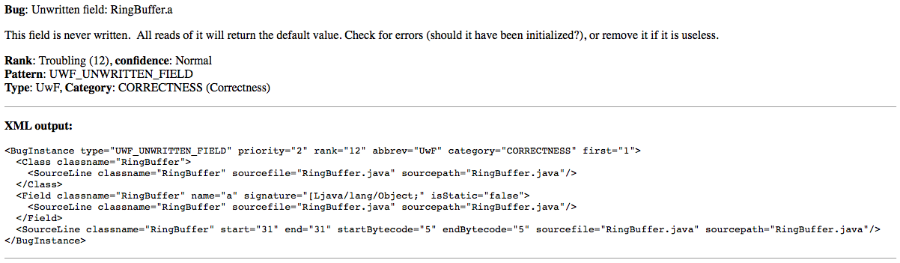

# Assignment Part A: Static Analysis for the RingBuffer

## *PMD*

PMD scans source code in Java and other languages and looks for potential problems like:

+ Possible bugs - empty try/catch/finally/switch statements
+ Dead code - unused local variables, parameters and private methods
+ Suboptimal code - wasteful String/StringBuffer usage
+ Overcomplicated expressions - unnecessary if statements, for loops that could be while loops
+ Duplicate code - copied/pasted code means copied/pasted bugs

For this assignment, we used *PMD* in the version 5.4.2. As PMD depends on rule sets, the output of PMD for the RingBuffer.java class might look different for each group. We used PMD as a command line tool with the following rule sets:

+ java-basic
+ java-design
+ java-unusedcode
+ java-imports
+ java-finalizers
+ java-unnecessary
+ java-naming
+ java-optimizations
+ java-empty

Using that much rule sets leads to a bunch of found problems. We let PMD generate a HTML-file for a better overview of all the found problems (see Abbildung 1). The full command for generating the PMD reports looks like this:

    ./run.sh pmd -dir /Users/martin/Documents/workspace/SoftwareTesting/
        assignment05-Team12-exercise01/src/team12/RingBuffer.java
        -f html -rulesets java-basic,java-design,java-unusedcode,
        java-imports,java-finalizers,java-unnecessary,java-naming,
        java-optimizations,java-empty
        -r result.html

The HTML-report, as well as the .csv-report can be found in the 
\newline `assignment05-Team12-exercise01/doc/` folder.

\newpage
## *FindBugs*

FindBugs is another static analysis analysis tool designed to find bugs in Java programs. Concretely, it looks for pieces of code that match specific patterns that are likely to be an error. Here, we used version 3.0.1 of FindBugs through the [Eclipse plugin](http://findbugs.sourceforge.net/manual/eclipse.html) to do the static analysis.

After installation, the tool offers the capability to scan an entire project for bugs. Applying this to a project with the bugged version of the `RingBuffer`, we get a bug overview as displayed below.

Each of these bugs comes with a more detailed description which can be retrieved by right clicking the bug and selecting "bug info". This displays a short overview of the bug and the corresponding xml description. For the three bugs in the `RingBuffer` this looks as follows

Eventually, there is also the possibility to generate a complete xml report for the project. This has been appended in `assignment05-Team12-exercise01/doc/findbugs-result.xml`.

\newpage
## Discussion

> *How many violations are detected by PMD and by FindBugs?*

|                 | PMD | FindBugs |
|-----------------|:---:|:--------:|
| Violation Count |  14 |        3 |

> *What is the indicated severity of the detected violations (called “priority” or “rank”).*

* *PMD:* 1 bug with priority 4/5 (Medium Low), 12 bugs with priority 3/5 (Medium) and 1 bug with priority 1/5 (High)
* *FindBugs:* 2 bugs with rank 8/20 (scary) and 1 bug with rank 12/20 (troubling) where 1 is the highest severity and 20 is the lowest

> *Are the detected violations real defects, warnings about potential defects or false alarms? (Include examples for the different categories in your answer.)*

* *PMD:* Most of the violations are just warnings about potential defects or even less important. For example, the violation with the highest severity is: "Variables should start with a lowercase character". The only violation that belongs to the introduced bug is: "Avoid unused constructor parameters such as 'capacity'" (Medium).
* *FindBugs:* Each of the detected bugs relate to the bug that has been introduced.

> *Which tool would you use in which situation in a software project?*

* *PMD:* Might be useful for things like java code style, variable names and so on to force developers to use a specific guideline.
* *FindBugs:* Might be useful to find out why a program does not work. Ideally, it would be used before the program ever runs in order to avoid the wondering why something went wrong.

> *What is the effort involved for using static analysis tools?*

The main effort is probably writing the tool, because the plugins are just really easy to use. Using PMD is quite easy. The only thing that is not so trivial is to choose the correct rule sets. If there are too much rule sets used, the number of (not so relevant) violations are booming. This can lead to some kind of frustration for developers and therefore to a low acceptance rate.
